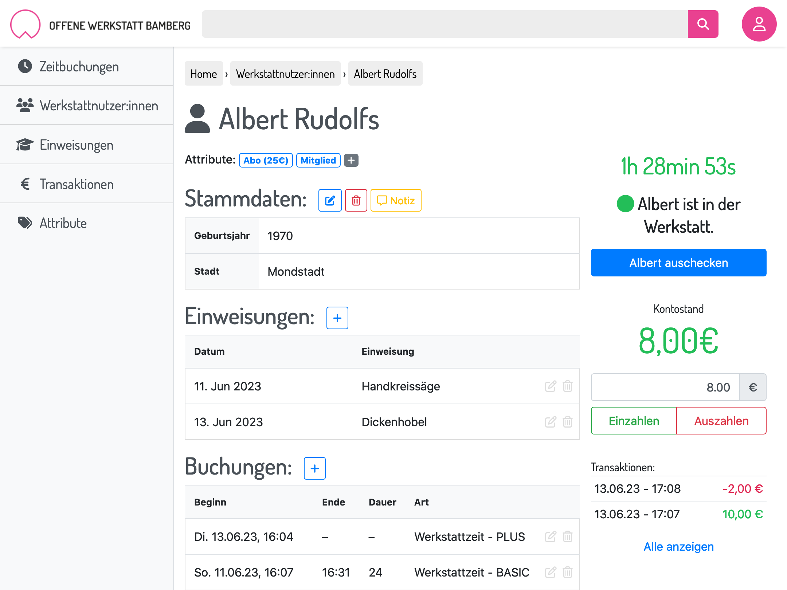

# mkspc mgmt

A Django app for user management for makerspaces.

### Features

- Add and manage users with basic demographic data
- Configurable introduction courses (optional: mandatory courses)
- Configurable attributes (e.g. to indicate membership or special knowledge)
- Configurable booking types with price and interval specification
- Automatic price calculation based on currently active attributes (e.g. reduced price for different subscription models)
- Stats (dashboard overview of all bookings, courses, people, etc.)

### Install

After install, run `on-init.sh` to create the initial database and super user.
